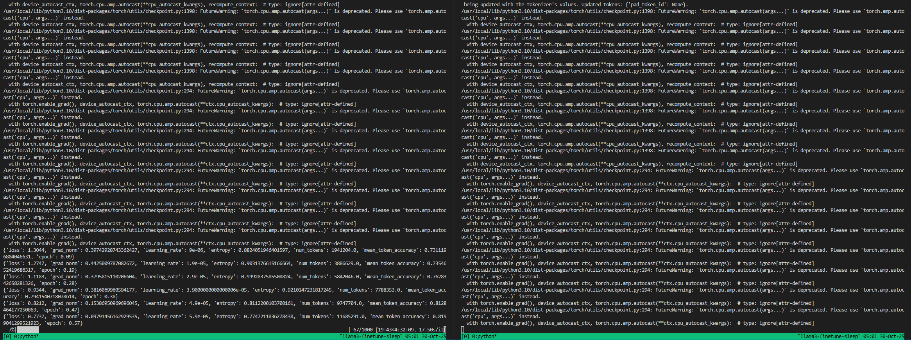

# Reproducibility Guide — Meta Llama 3 Multi-node Fine-tuning 

This guide reproduces the fine-tuning run for Meta Llama 3 8B Instruct on the XLAM-60k function-calling dataset across 2 nodes × 8 GPUs.

## Prerequisites
- Kubernetes cluster with Kubeflow PyTorch Operator installed
- Two Nebius nodes with 8× NVIDIA H100 each and a shared RWX storage class
- `kubectl` access and permissions to create PV/PVC, secrets, and jobs
- Container image access: `nvcr.io/nvidia/pytorch:24.07-py3`
- Hugging Face token with access to `meta-llama/Meta-Llama-3-8B-Instruct`
- Weights & Biases API key (optional but recommended)

## 0) Build Kubernetes cluster
### 0.1) Follow Nebius documentation to provision a Kubernetes cluster


## 0.2) Create PVC


## 0.3) Assign Node Groups
- 2 worker nodes, each with 8× NVIDIA H100 GPUs
- High-speed networking (InfiniBand preferred)
- RWX storage class for shared Persistent Volume 2TB
- Storage - 2TB
- Memory - 3200GB


## 0.4) Setup kubectl and Nebius profile

- install `kubectl` and `nebius` CLI tools
- configure `kubectl` context to point to your Nebius Kubernetes cluster
- verify access: federation vs Service Account
- Install PyTorchJob Operator for Kubeflow
```bash
hari@ADG-2MQ50106PK:~/nebius/distrbuted_training_tools$ kubectl config get-contexts
CURRENT   NAME                          CLUSTER                       AUTHINFO                      NAMESPACE
*         nebius-mk8s-hari-cluster-04   nebius-mk8s-hari-cluster-04   nebius-mk8s-hari-cluster-04   
```

## 1) Job submission
- Create a sleep job to have long-running pods for exec/debugging:
    - 2 nodes ( 1 master + 1 worker), 8 GPUs each
```bash
kubectl apply -f distrbuted_training_tools/llm_finetune/code/sleep.yaml
#OR create_job.sh
```
- Wait for pods to be Running:


- Exec into one of the pods
```bash
kubectl exec -it llama3-finetune-sleep-job-master-0 -- bash
kubectl exec -it llama3-finetune-sleep-job-worker-0 -- bash
```

## 2) Clone the repository
```bash
# on your workstation or an admin pod
git clone https://github.com/IamNirmata/distrbuted_training_tools.git
cd distrbuted_training_tools/llm_finetune
```

## 2) Provision shared storage (PV/PVC)
Confirm your cluster has a RWX storage class. Apply the sample manifest:
```bash
kubectl apply -f code/pvc.yaml
```
This creates:
- PV `external-storage-persistent-volume` (2Ti)
- PVC `external-storage-persistent-volumeclaim` mounted as `/mnt/data`

## 3) Create secrets
```bash
# Replace the example values with your actual tokens
kubectl create secret generic hf-secret \
  --from-literal=token="<HF_TOKEN>"

kubectl create secret generic wandb-secret \
  --from-literal=api_key="<WANDB_API_KEY>"
```

## 4) Setup environment and prefetch data/model
- 8-pre-launch.sh script performs:
    - Install dependencies from requirements.txt (0-setup.sh)
    - Declare env vars ( HF_TOKEN, wandb API key, NCCL, pytorch distributed settings) (0-setup.sh)
    - Prefetch dataset - xlam-function-calling-60k ( 1-data.sh )
    - Prefetch base model - meta-llama/Meta-Llama-3-8B-Instruct ( 2-model.sh )
    - sanity check for data and model paths (8-pre-launch.sh)
    - sanity check for GPU visibility, NCCL setting, and distributed setup (8-pre-launch.sh)

```bash
bash 8-pre-launch.sh
```


## 5) Launch training
### 5.1) Single node training (for testing) using DDP
To validate the setup, you can run a single-node training job using DDP with 8 GPUs.

```bash
torchrun --nproc_per_node=8 --nnodes=1 --node_rank=0 --master_addr="$MASTER_ADDR" --master_port="$MASTER_PORT" ddp.py
#OR bash launch.sh can be configured for single node
```
### 5.2) Multi-node training using torchrun FSDP and QLoRA

```bash
torchrun --nproc_per_node=8 --nnodes=2 --node_rank=0 --master_addr="$MASTER_ADDR" --master_port="$MASTER_PORT" fsdp_no4.py
```



## 6) Monitor and logs
- We use wandb for experiment tracking. You can also monitor pod logs directly.
    - DDP run - https://wandb.ai/iamnirmata-microsoft/func_calls_llm/runs/vdjf68ts?nw=nwuseriamnirmata
    - FSDP run - https://wandb.ai/iamnirmata-microsoft/func_calls_llm/runs/wixn5rm8?nw=nwuseriamnirmata


 


## 7) Collect artifacts (adapters)
Adapters are saved under `/mnt/data/output/llama-3-8b-function-calling`.
Use the helper to tar them to your local machine:

```bash
cd `/mnt/data/output/llama-3-8b-function-calling
```bash
cd /mnt/data/output/llama-3-8b-function-calling && tar -czvf "llama3_adapters_$(date +%Y%m%d-%H%M%S).tgz" .

```
- Then kubectl cp to your local machine:
```bash
kubectl cp llama3-finetune-job-master-0:/mnt/data/output/llama-3-8b-function-calling/llama3_adapters.tgz .
```

## 8) Load adapters for inference (example)
```python
from transformers import AutoTokenizer, AutoModelForCausalLM, BitsAndBytesConfig
from peft import PeftModel
import torch

BASE = "/mnt/data/models/Meta-Llama-3-8B-Instruct"
ADAPTER_DIR = "/mnt/data/output/llama-3-8b-function-calling"

bnb_config = BitsAndBytesConfig(
    load_in_4bit=True,
    bnb_4bit_quant_type="nf4",
    bnb_4bit_compute_dtype=torch.float16,
    bnb_4bit_use_double_quant=True,
)

tok = AutoTokenizer.from_pretrained(BASE, trust_remote_code=True)
model = AutoModelForCausalLM.from_pretrained(
    BASE, quantization_config=bnb_config, torch_dtype=torch.float16, trust_remote_code=True
)
model = PeftModel.from_pretrained(model, ADAPTER_DIR)
model.eval()

prompt = """<user>Find restaurants in Seattle open now for dinner</user>
<tools>[{"name": "searchRestaurants", "args": ["city", "open_now"], "returns": ["name", "address", "hours"]}]</tools>
<calls>"""

inputs = tok(prompt, return_tensors="pt").to(model.device)
with torch.no_grad():
    out = model.generate(**inputs, max_new_tokens=256)
print(tok.decode(out[0], skip_special_tokens=False))
```
